# Dogfood Report: 长卷制片厂

| Field | Value |
|-------|-------|
| **Date** | 2026-09-09 |
| **App URL** | Electron `http://127.0.0.1:<dynamic>/desktop/` |
| **Session** | `novel-dogfood` |
| **Scope** | 桌面 App 全功能、核心流程、错误状态与三端共享交互 |

## Summary

| Severity | Count |
|----------|-------|
| Critical | 0 |
| High | 3 |
| Medium | 3 |
| Low | 1 |
| **Total** | **7** |

## Remediation

| Issue | Status | Verification |
|-------|--------|--------------|
| ISSUE-001 | Fixed | Four desktop and four mobile navigation controls switch to distinct populated views. |
| ISSUE-002 | Fixed | Gutenberg retry returns six valid sources for `Alice's Adventures in Wonderland`. |
| ISSUE-003 | Mitigated | Completed demo projects auto-refresh generated images; manual refresh uses a restricted server proxy. Upstream may still return its generating placeholder. |
| ISSUE-004 | Fixed | Final desktop WCAG 2 A/AA audit: 0 violations; only contrast checks for partially obscured, scroll-clipped rows remain inconclusive. |
| ISSUE-005 | Fixed | Retry clears the previous error before discovery restarts. |
| ISSUE-006 | Fixed | Restored projects synchronize the title input unless the user is actively editing it. |
| ISSUE-007 | Fixed | Demo projects now show zero generated videos and stop before assembly; a preflight gate blocks unauthorized or over-budget model calls. |

## Task Center Acceptance

- Submitted three projects against one configured project slot and observed `1 running / 2 queued`.
- Verified FIFO positions `1/2` and `2/2`, wait estimates, and automatic promotion when a slot became available.
- Verified restart recovery for interrupted, queued, and remotely rendering projects.
- Verified status filters, title/source search, historical-project restoration, and failed-task retry entry.
- Verified desktop and 390×844 mobile layouts with six working mobile destinations.
- Automated suite: 31 passing tests.

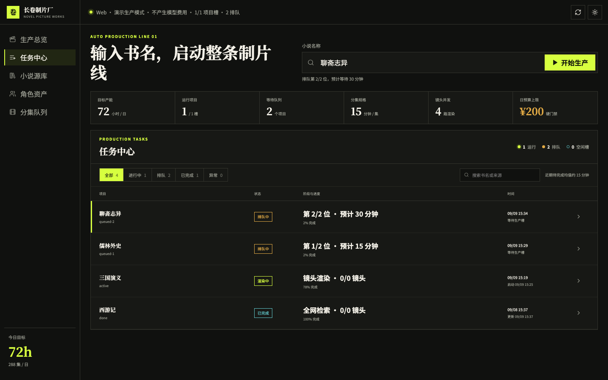

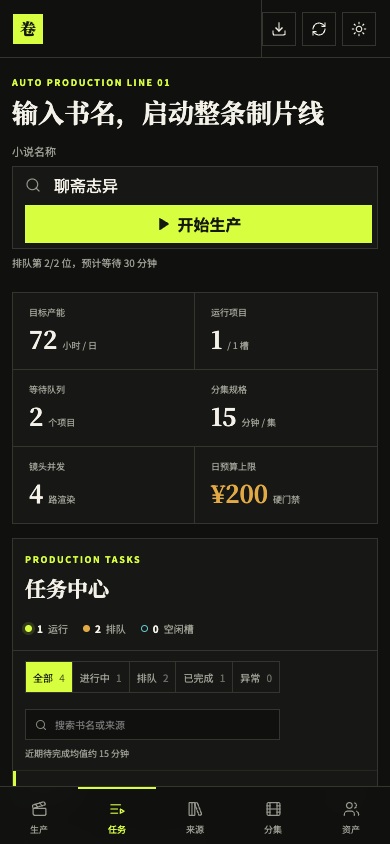

## Project Center Acceptance

- Verified the app opens at the project center without implicitly entering the latest project.
- Verified create-project modal, project search/status filters, visual project cards, six-node progress rails, queue/status metrics, and project entry.
- Verified project-scoped navigation is disabled before selection, enabled after entering a project, and disabled again after returning to the project center.
- Verified project deep links preserve project ID and detail view in the URL.
- Desktop 1120×720 and mobile 390×844 audits report 0 WCAG 2 A/AA violations and no horizontal overflow.

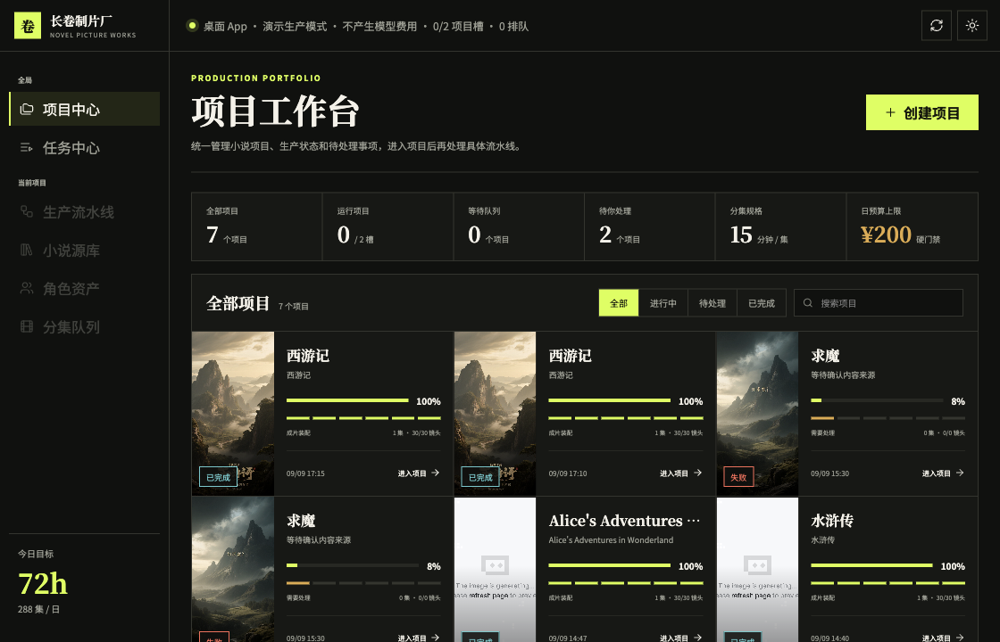

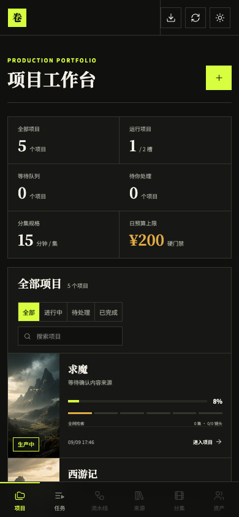

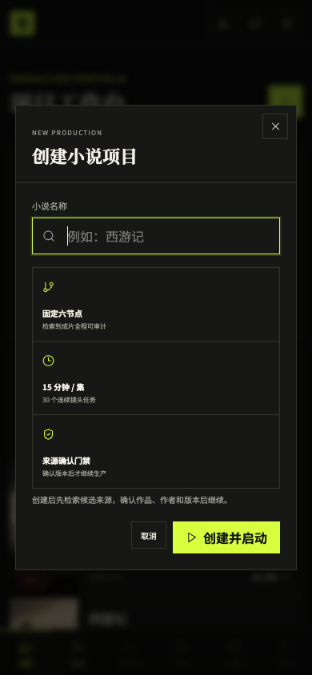

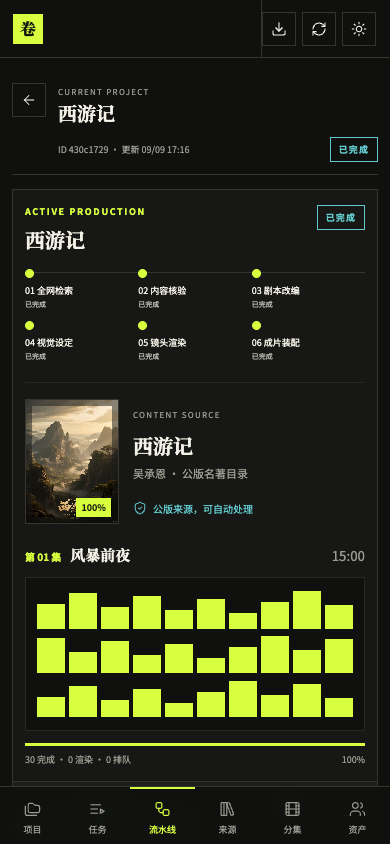

## Source Confirmation and Pipeline Acceptance

- Submitted `西游记` in both the final Electron package and the 390×844 mobile PWA.
- Verified discovery pauses at `source-review`; no source is committed and no downstream node runs before confirmation.
- Verified the candidate view exposes title, author, content level, provider, rights status, match score, and the original-source link.
- Confirmed the selected source and observed all six fixed nodes complete: discovery, ingestion, adaptation, visual design, shot rendering, and assembly.
- Opened node 03 in the final Electron and mobile builds and verified persisted input, output, status, timestamp, duration, and long-output scrolling.
- Final WCAG 2 A/AA audits report 0 violations on the source-review page and node dialog. The dialog audit has one inconclusive contrast check because axe cannot resolve the partially overlapped code-block background.

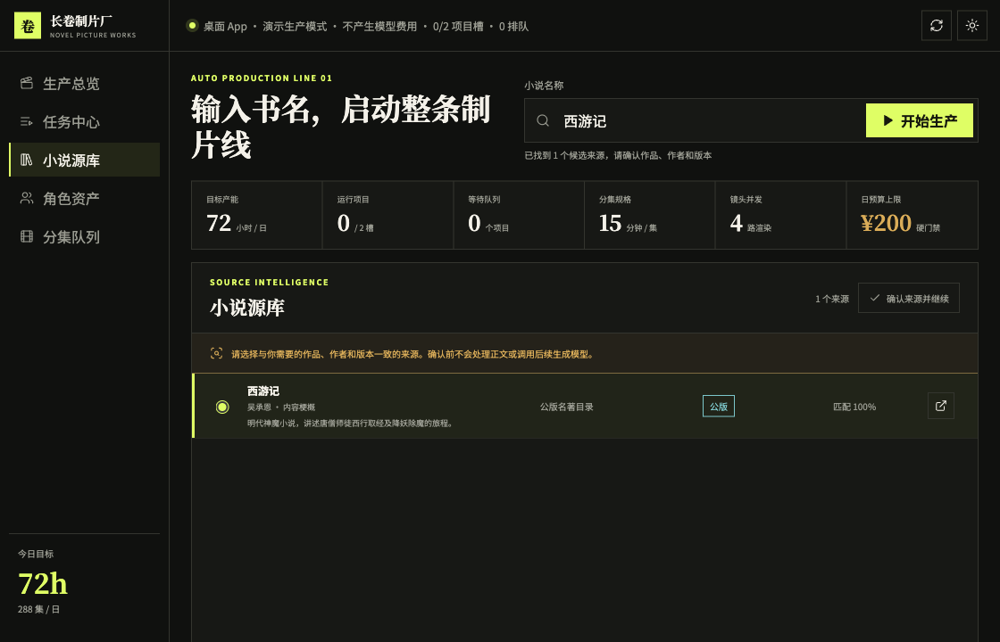

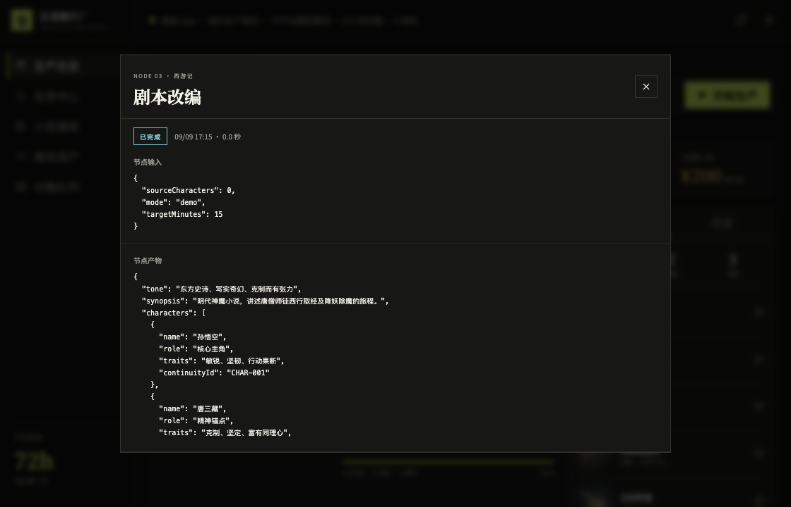

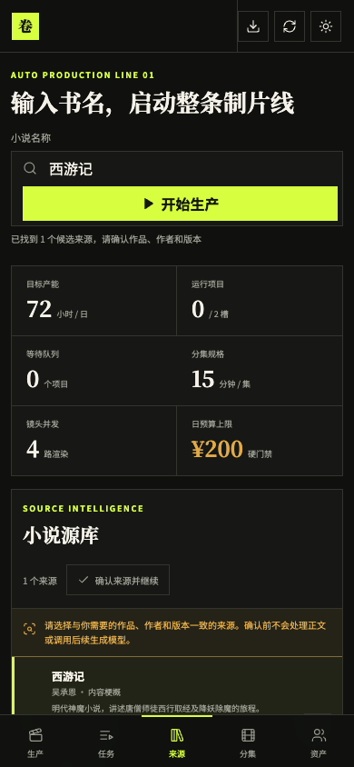

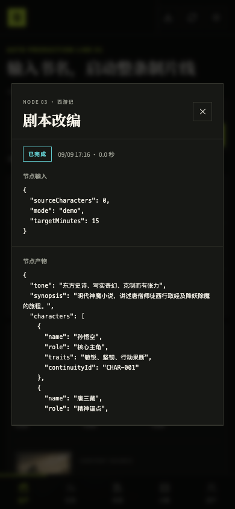

## Domestic Search and Source Registry Acceptance

- Rechecked 23 accepted official sources across Chinese web fiction, public-domain classics, overseas originals, and digital libraries on 2026-09-09.
- Retried `求魔` and verified two exact official candidates: Qidian `https://www.qidian.com/book/2070910/` and QQ Reading `https://book.qq.com/book-detail/481326`.
- Verified 26 auditable search runs covering 360 domestic web search, configured site queries, international catalogs, and optional Brave Search.
- Each run exposes its query URL, completion/degraded/failure state, hit count, elapsed time, and error.
- Verified the source registry preserves category, free mode, registration, Web/download support, advertising, copyright notes, automation policy, and availability.
- Verified `cn-qidianzww.com.cn`, `hetushu.com`, and `www.hetushu.com` cannot be restored through the configuration API.
- Verified historical projects can explicitly rerun discovery with the current registry instead of silently rewriting stored traces.
- Desktop 1120×720 and mobile 390×844 trace views, plus the source configuration dialog, report 0 WCAG 2 A/AA violations.

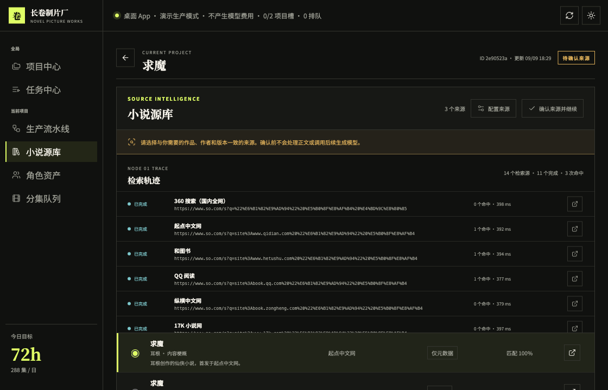

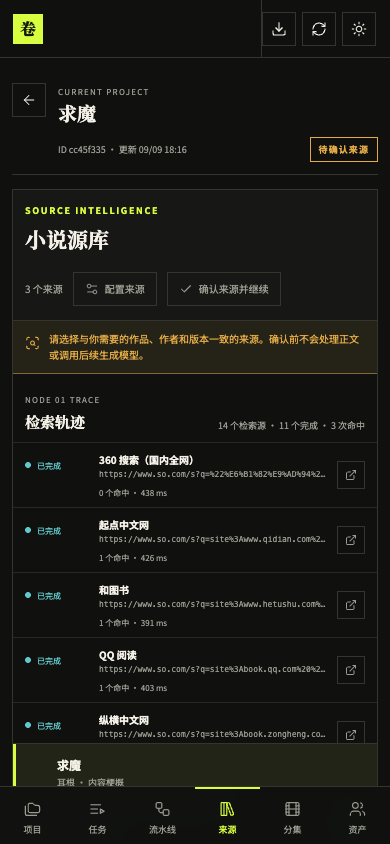

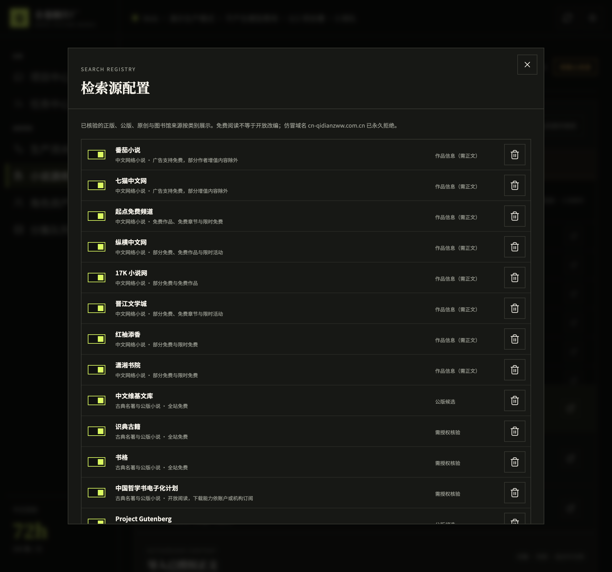

## Public-Domain Recommendation Acceptance

- Verified 16 curated works: eight Chinese classics and eight English classics.
- Verified every item is normalized to `public-domain`, requires no additional authorization, and links only to the trusted recommendation-source allowlist.
- Verified language filters return eight Chinese and eight English works; keyword search matches title, author, genre, and tags.
- Verified every card exposes rights evidence, the original source, and one-click project creation; the created title re-enters the existing source-confirmation and six-node audit workflow.
- Verified desktop rendering and an emulated 390×844 mobile viewport. The mobile layout has no horizontal overflow, and the recommendation count, all three card actions, and all seven navigation destinations remain within the viewport.
- Automated suite: 30 passing tests.

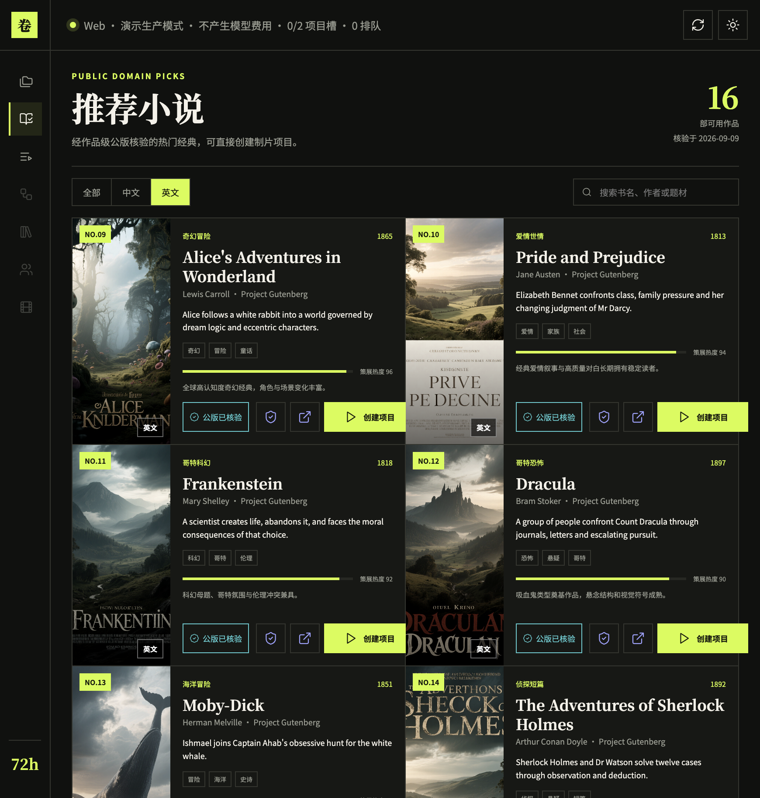

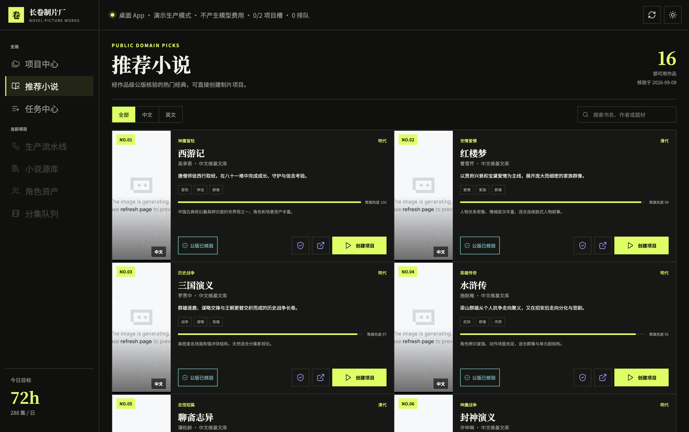

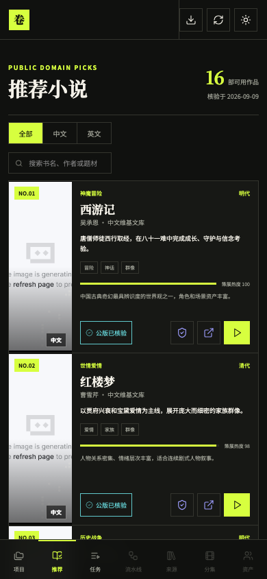

## Authorized Full-Text Import Acceptance

- Verified commercial-source candidates expose an authorized TXT/Markdown import workflow instead of attempting to bypass WAF, login, or payment controls.
- Verified 12 MB file-size enforcement, 500-character minimum, explicit rights confirmation, and disabled submission until both content and confirmation are present.
- Verified the UI reads the selected local file, displays filename, character count and the first 2,000 characters without submitting the test file.
- Backend tests verify complete text persistence outside project JSON, SHA-256 recording, path confinement, ingestion metadata, and automatic pipeline resume.
- Desktop preview reports 0 WCAG 2 A/AA violations.

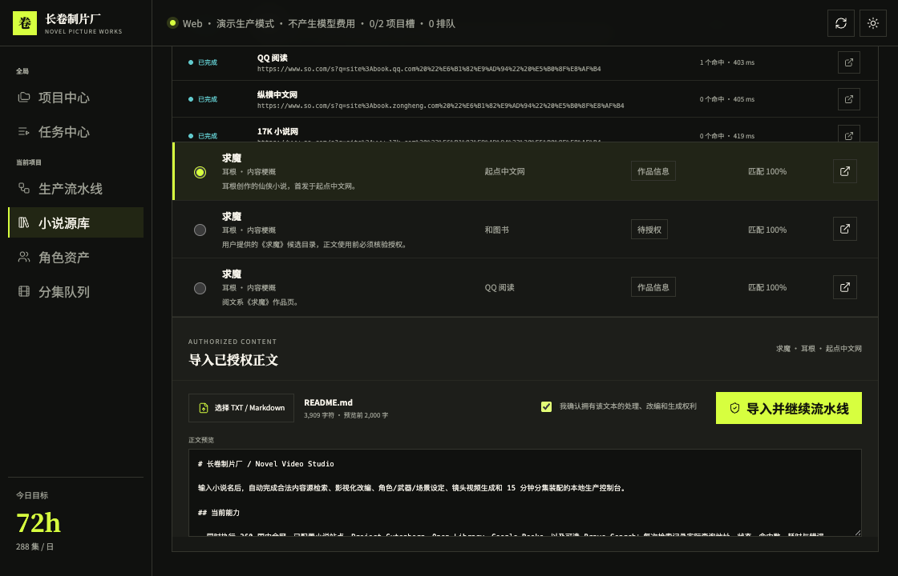

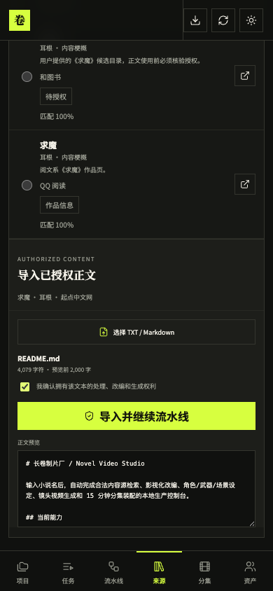

## Issues

<!-- Copy this block for each issue found. Interactive issues need video + step-by-step screenshots. Static issues (typos, visual glitches) only need a single screenshot -- set Repro Video to N/A. -->

### ISSUE-001: 三个主导航按钮点击后无任何响应

| Field | Value |
|-------|-------|
| **Severity** | high |
| **Category** | functional |
| **URL** | `/desktop/` |
| **Repro Video** | `videos/issue-001-repro.webm` |

**Description**

左侧“小说源库”“角色资产”“分集队列”均呈现为可点击按钮，但点击后选中态和主内容均不变化。用户无法进入三个核心业务视图。

**Repro Steps**

<!-- Each step has a screenshot. A reader should be able to follow along visually. -->

1. 打开桌面 App，停留在生产总览。
   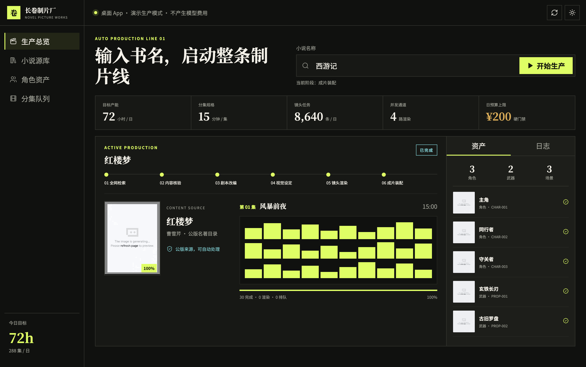

2. 点击“小说源库”。

3. **观察：** 主页面和导航选中态均未变化。
   

---

### ISSUE-002: 合法公版作品因固定超时被误判为“未找到来源”

| Field | Value |
|-------|-------|
| **Severity** | high |
| **Category** | functional |
| **URL** | `/desktop/` |
| **Repro Video** | N/A |

**Description**

输入 Project Gutenberg 明确收录的 `Alice's Adventures in Wonderland` 后，四个检索请求均在固定 8 秒超时，项目失败并显示“未找到可识别的小说来源”。同机直接访问 Gutendex 可在约 11 秒返回 6 个结果，说明失败来自客户端超时策略而非无结果。

**Repro Steps**

1. 输入 `Alice's Adventures in Wonderland` 并点击“开始生产”。
2. 等待检索完成，进入“小说源库”。
3. **观察：** 页面显示 0 个来源及“未找到可识别的小说来源”。
   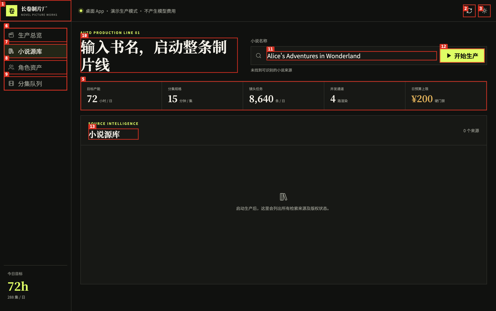

---

### ISSUE-003: 演示视觉资产长期停留在“生成中”占位图

| Field | Value |
|-------|-------|
| **Severity** | medium |
| **Category** | visual / ux |
| **URL** | `/desktop/` |
| **Repro Video** | N/A |

**Description**

演示模式首次请求图片服务时可能返回“image is generating”占位图。应用此前不会主动重新获取，导致封面和全部资产缩略图长期不可用。

**Repro Steps**

1. 完成一个演示生产任务并进入“角色资产”。
2. **观察：** 所有资产均停留在生成中占位图。
   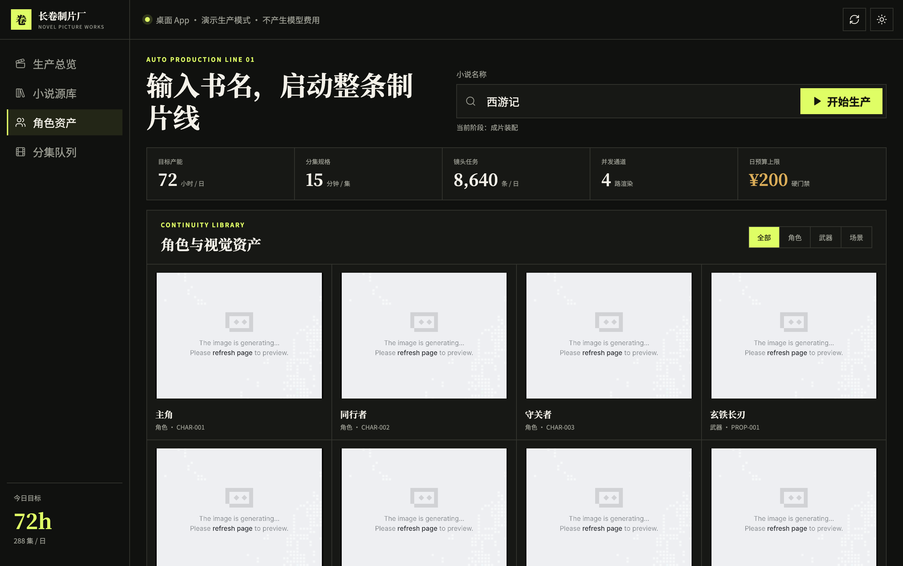

---

### ISSUE-004: 分组、阶段和标签页缺少完整 ARIA 语义

| Field | Value |
|-------|-------|
| **Severity** | low |
| **Category** | accessibility |
| **URL** | `/desktop/`、`/mobile/` |
| **Repro Video** | N/A |

**Description**

axe-core 指出资产筛选和生产阶段容器在普通 `div` 上使用 `aria-label` 却没有有效角色；资产/日志声明了 `tablist`，子按钮却没有 `tab` 和选中状态。辅助技术无法可靠理解这些控件之间的关系。

**Repro Steps**

1. 对资产页执行 WCAG 2 A/AA 自动审计。
2. **观察：** 审计报告出现 `aria-prohibited-attr` 与 `aria-required-children`。

---

### ISSUE-005: 失败任务重试成功后仍显示旧错误

| Field | Value |
|-------|-------|
| **Severity** | medium |
| **Category** | functional / ux |
| **URL** | `/desktop/` |
| **Repro Video** | N/A |

**Description**

来源检索失败后点击“重试任务”，项目可成功完成并得到 Gutenberg 来源，但输入区下方仍显示上一次的“未找到可识别的小说来源”。项目状态与提示信息互相矛盾。

**Repro Steps**

1. 打开一个来源检索失败的项目。
2. 在“分集队列”点击“重试任务”，等待项目完成。
3. **观察：** 项目显示已完成且来源有效，顶部仍保留旧错误。
   

---

### ISSUE-006: 当前项目与书名输入框显示不同作品

| Field | Value |
|-------|-------|
| **Severity** | medium |
| **Category** | ux |
| **URL** | `/desktop/` |
| **Repro Video** | N/A |

**Description**

应用恢复历史项目时，项目内容显示 `Alice's Adventures in Wonderland`，输入框却保留硬编码的“西游记”。用户难以判断再次点击“开始生产”会处理哪部作品。

**Repro Steps**

1. 创建其他作品项目并重新打开桌面 App。
2. **观察：** 当前项目标题与书名输入框内容不一致。
   

---

### ISSUE-007: 演示任务被错误显示为真实视频已完成

| Field | Value |
|-------|-------|
| **Severity** | high |
| **Category** | functional / trust |
| **URL** | `/desktop/`、`/mobile/`、`/web/` |
| **Repro Video** | N/A |

**Description**

演示模式没有调用 Seedance，镜头没有远端任务 ID、视频 URL 或本地 MP4，但旧状态机仍把 30 个镜头和成片装配标记为完成。

**Resolution**

演示模式现在停在“演示预览”，显示“30 个镜头已规划 · 0 个视频已生成”，渲染节点暂停且装配节点不再完成。真实模式会在任何 Ark 调用前检查 API Key、计费授权和单集预算；15 分钟 720P 当前参考估算约为 `¥1,360.80`。

---
