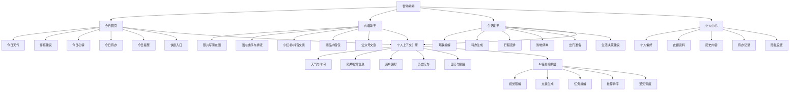

# 智助乖乖产品设计

## 1. 产品定位

智助乖乖不是一个“什么都能问”的 AI 聊天工具，而是一个围绕“今天”工作的生活与内容助手：

```text
感知今天 → 给出建议 → 一键执行 → 自动记录
```

首要用户是有日常安排、内容表达和琐事处理需求的普通用户与小商家。Web 端承载完整产品矩阵与高级生产能力，小程序承载高频、低门槛、可审核的日常入口。

## 2. 用户问题

- 不知道今天该做什么，待办容易遗漏。
- 不知道天气变化，出门忘记带伞或穿错衣服。
- 拍了照片，但不会写朋友圈文案，也不会安排图片顺序。
- 有很多琐事，不知道如何拆解成可执行步骤。
- 想做决定，但缺少即时、低成本的建议。

## 3. 产品架构



## 4. 端侧分工

| 端 | 首要职责 | 首期范围 |
| --- | --- | --- |
| 微信小程序 | 高频获客与留存 | 今日、天气建议、照片文案、琐事拆解、待办 |
| Web/PWA | 完整工作台与收费 | 商品内容包、公众号、社群、批量内容、视频 |
| Electron | 重度创作生产 | 批量素材、视频、长任务、桌面文件 |

## 5. 小程序 1.0 页面矩阵

| 页面 | 类型 | 首期能力 |
| --- | --- | --- |
| 今日 | TabBar | 天气卡、穿搭建议、心情、待办摘要、快捷入口 |
| 内容 | TabBar | 生成记录、商品内容包入口、照片文案入口 |
| 我的 | TabBar | 个人资料、数据统计、通知和隐私入口 |
| 照片写朋友圈 | 二级页 | 选择照片、风格选择、文案生成、图片顺序建议、复制 |
| 今日待办 | 二级页 | 新增、完成、删除、拖延提示 |
| 琐事拆解 | 二级页 | 输入一件烦杂事情，生成步骤清单 |

## 6. 变现路径

```text
免费今日助手
→ 高频使用
→ 照片/内容需求增加
→ 购买多图内容包或商品内容包
→ 进入 Web 高级工作台
```

天气和基础待办作为留存入口，不直接收费。收费集中在多图排版、完整朋友圈内容包、商品短视频内容包、批量生成和高级模板。

## 7. 首期审核边界

小程序首版不展示 AI 绘画、AI 视频生成、复杂 AI 问答、多模型配置等高风险或非必要能力。首版名称与交互强调“生活整理、内容整理、模板辅助”，功能先以本地优先和结构化结果为主；Web 继续承载完整 AI 生产矩阵。

## 8. 验证指标

1. 今日首页打开后完成一次操作的比例。
2. 照片文案生成完成率与复制率。
3. 待办次日完成率。
4. 24 小时回访率。
5. 内容包解锁点击率与实际支付成功率。

## 9. 开发顺序

1. 今日首页与本地待办。
2. 照片选择、文案模板和图片排序建议。
3. 琐事拆解。
4. 个人偏好与历史记录。
5. 正式版发布后，再开启虚拟支付和高级内容解锁。

## 10. 当前工程落地

- 共享服务模块：`lib/life-assistant.mjs`
- 共享 API：
  - `GET /api/life/today`
  - `PUT /api/life/tasks`
  - `PUT /api/life/mood`
  - `POST /api/life/photo-copy`
  - `POST /api/life/chore`
- Web/PWA 首个生活助手入口：`/life/`
- 小程序共享服务封装：`apps/miniapp/src/services/lifeAssistant.ts`
- 当前天气、文案和琐事拆解使用可替换的本地模板源，数据结构已固定，后续可以接入真实天气、视觉模型和用户身份同步。
